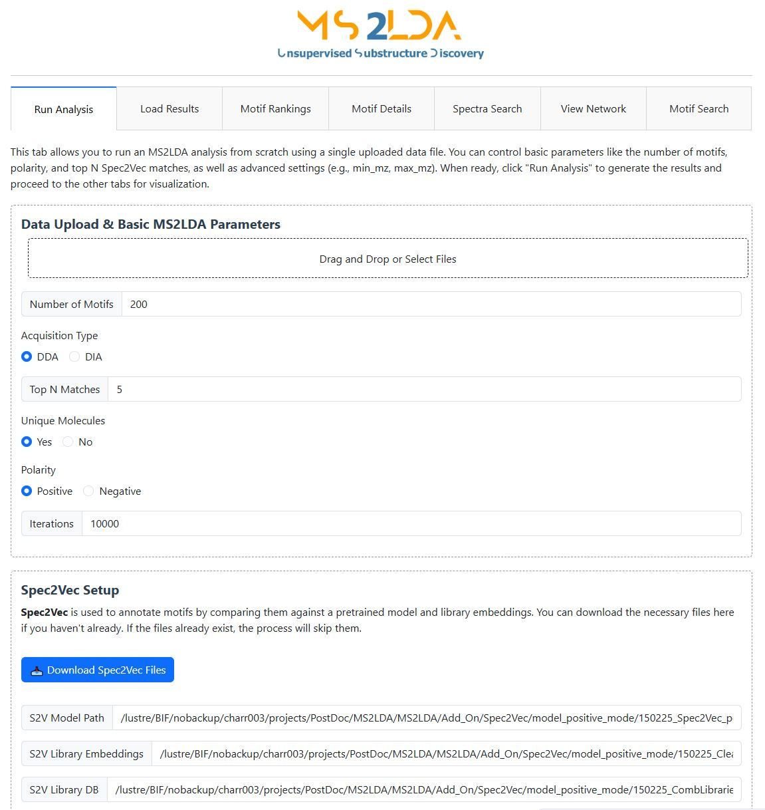

# MS2LDAViz — Interactive Web Interface 🌐

MS2LDAViz lets you run analyses and explore your results in your browser, with live controls and rich visualizations.

---

## 1. Launching the App

The MS2LDA repository includes convenient scripts that allow the easy access to the Viz App. If you have not cloned the repository and created a conda enviroment, please go to [**Getting Started**](./home/quick_start.md), afterwards you will find inside the MS2LDA folder the following scripts:

- **`run_ms2ldaviz.sh`** (Linux/macOS)  
- **`run_ms2ldaviz.bat`** (Windows)

In order to use the scripts please type:

```bash
# For Linux/macOS
./run_ms2ldaviz.sh

# For Windows 
./run_ms2ldaviz.bat
```

Aftewards you will be redirected to the following website:

