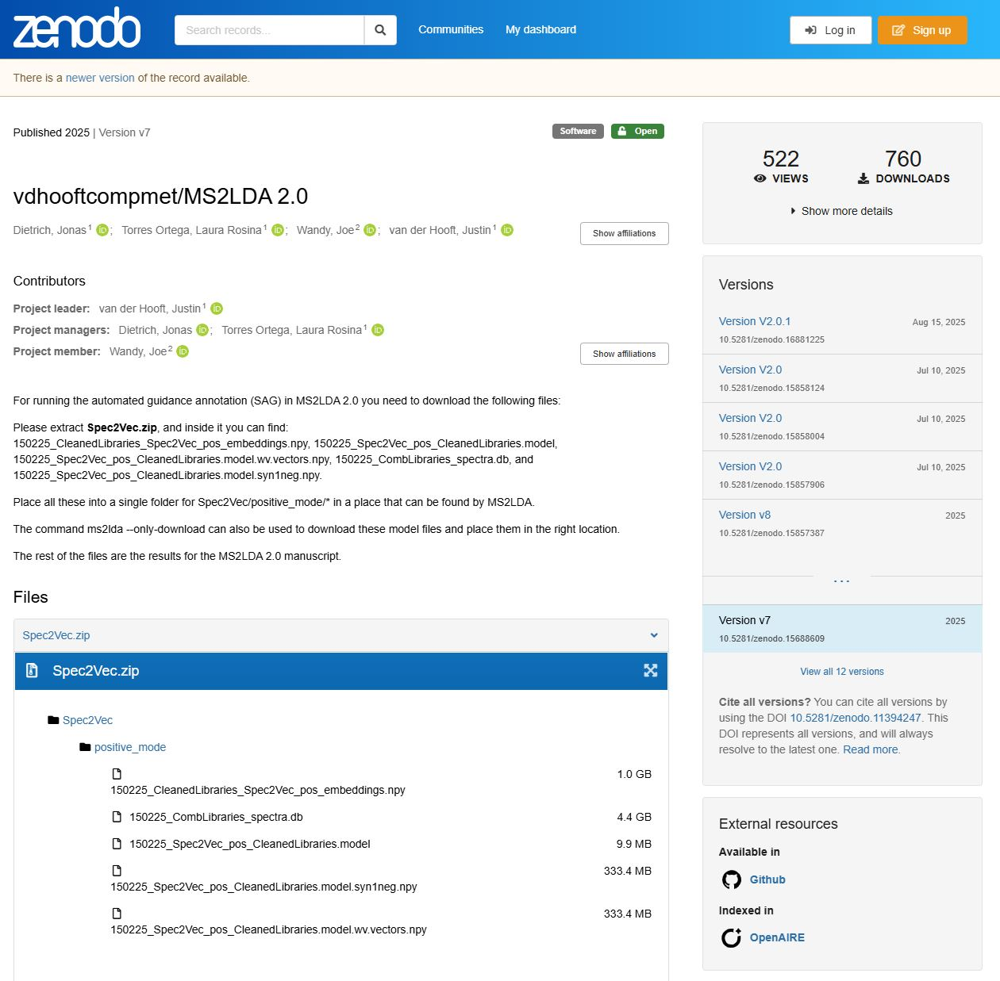
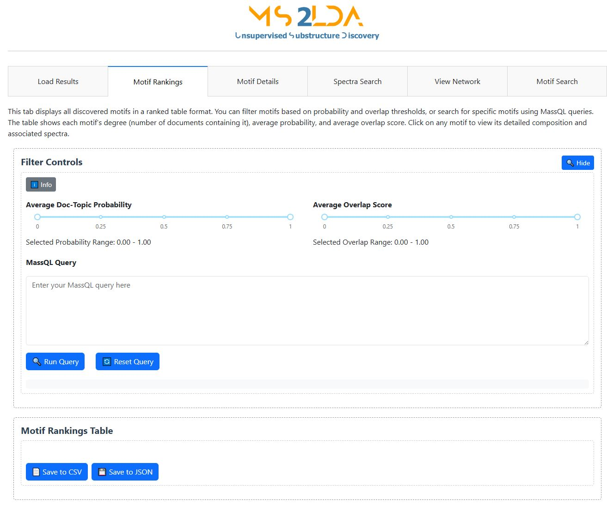
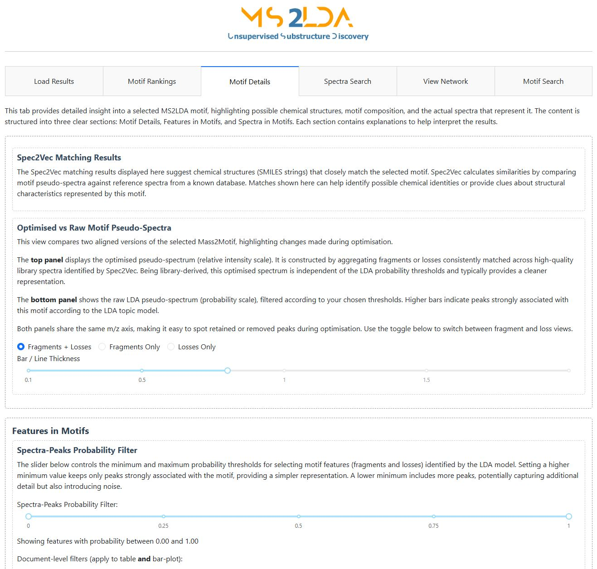
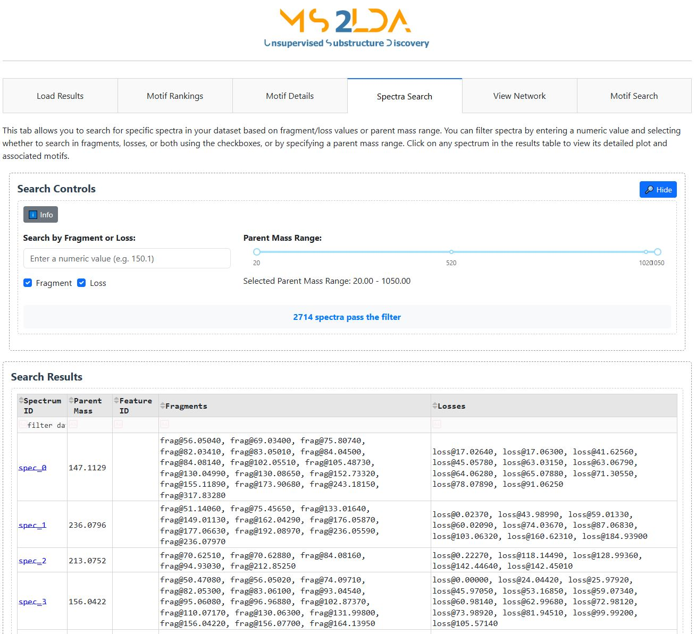
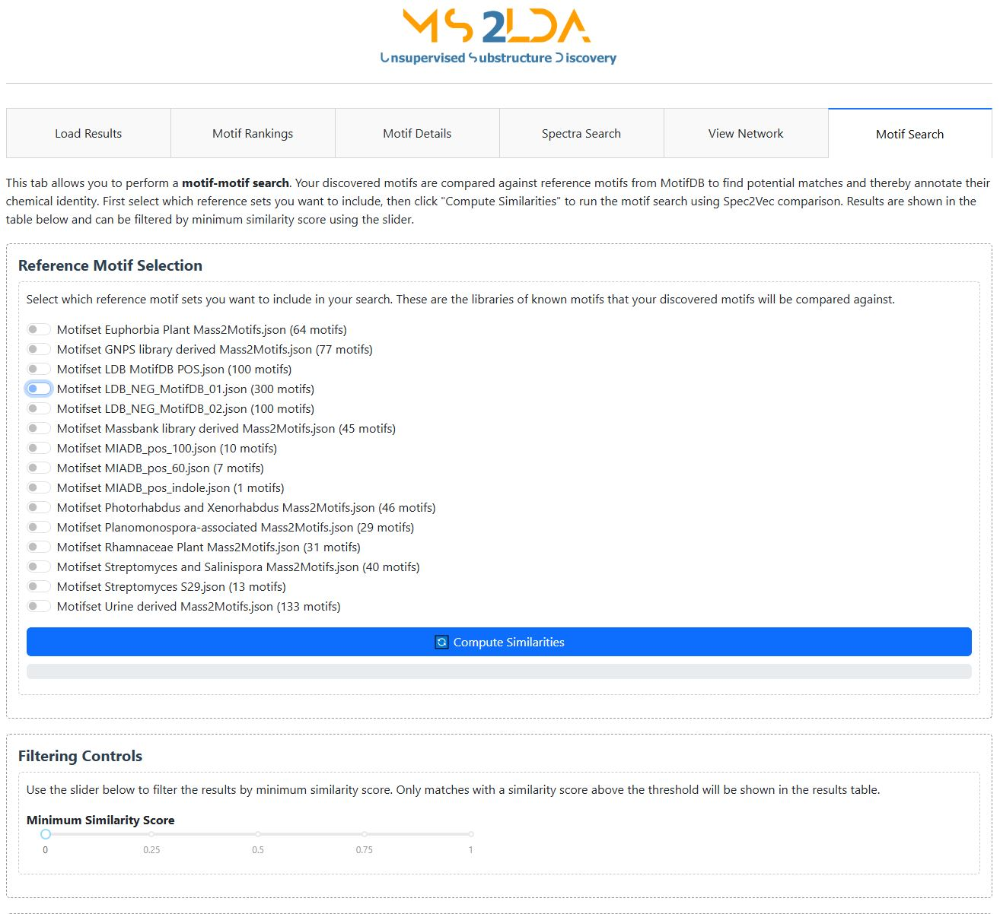

# MS2LDAViz — Interactive Web Interface 🌐

MS2LDAViz lets you run analyses and explore your results in your browser, with live controls and rich visualizations.

---

## 1. Launching the App

The MS2LDA repository includes convenient scripts that allow the easy access to the Viz App. If you have not cloned the repository and created a conda enviroment, please go to [**Getting Started**](./home/quick_start.md), afterwards you will find inside the MS2LDA folder the following scripts:

- **`run_ms2ldaviz.sh`** (Linux/macOS)  
- **`run_ms2ldaviz.bat`** (Windows)

In order to use the scripts please type:

```bash
# For Linux/macOS
./run_ms2ldaviz.sh

# For Windows 
./run_ms2ldaviz.bat
```

Aftewards you will be redirected to the following website [(http://127.0.0.1:8000/….)](http://127.0.0.1:8000/….)


There you could access different tabs, explained below:

- **Run Analysis**: Upload your MS/MS spectra (positive/negative ion mode), set core parameters, and start a new run.
**Note:** Before running MS2LDA you must **download** the Spec2Vec model, embeddings, and library DB (See the [Zenodo repository](https://zenodo.org/records/15688609)).



- **Load Results**: Open a previous MS2LDA run (compressed JSON format) or load a **demo dataset**. After the run finishes, the other tabs will automatically be updated.


- **Motif Rankings**: Browse all Mass2Motifs ranked by probability and overlap thresholds, or search for specific motifs using **MassQL** queries. You can click a motif to view its details on the next tab.



- **Motif Details**: Inspect selected motifs in depth: suggested structures/annotations from MAG, fragment and neutral-loss composition in optimized pseudo-spectra based on probability filters, and the spectra that load on it.



- **Spectra Search**: Find individual spectra by parent mass or fragment/loss values, and check their spectra and associated motifs.



- **View Network**: Explore an interactive network of optimized motifs, where each M2M is displayed as a node connected to its fragments ands losses.


- **Motif Search**: Perform motif-motif searches against reference motifs in MotifDB. This updates the Motif annotations in previous tabs.



Ready to jump to the Command-line? Then see 💻 otherwise please refer to our "Examples and Tutorials" 📚

[Command-line Guide](MS2LDAViz_Command_Line.md){ .md-button} [Examples & Tutorials](../examples/tutorials.md){ .md-button}