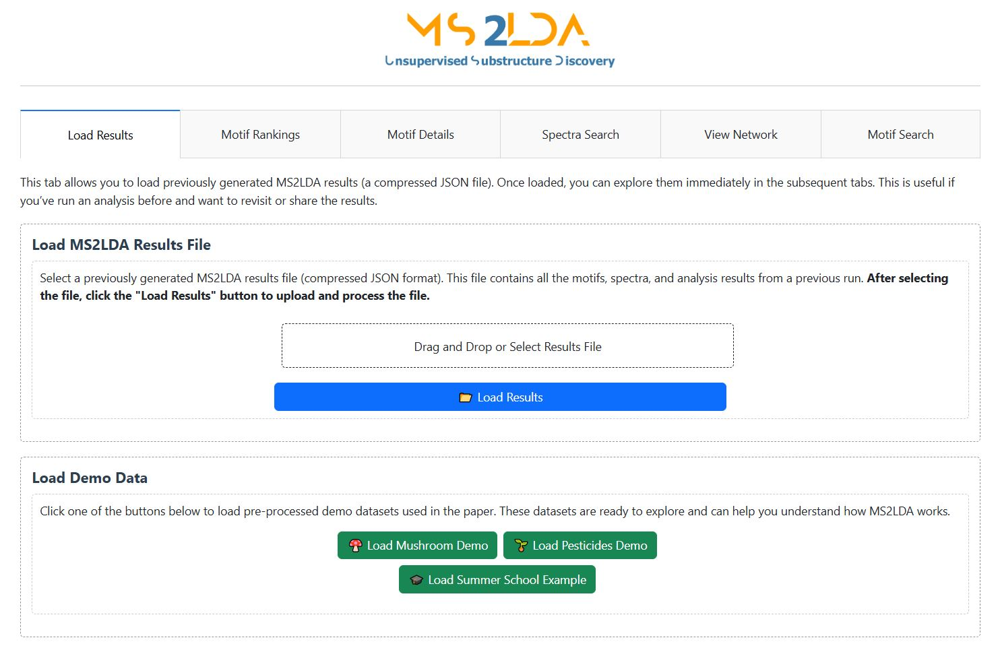

# MS2LDA User Guide Overview

MS2LDA’s functionality is organized into **modular steps**, each performing a discrete task on your MS/MS data. Below is just a high‑level overview of the process.

##Modules at a Glance:  
• **Preprocessing** → filter & clean your spectra (positive/negative ion mode)

• **Modeling** → infer Mass2Motifs via LDA  

• **Annotation** → assign substructure meaning (currently MAG is trained on positive ionization mode data)

• **Visualization** → explore and export results

All modules are explained in detail in the [**Modules Reference**](../api/) tab.

Try the [MS2LDAViz 2.0 website](https://ms2lda.org/viz/) in your browser. Here you can load previously generated results file or explore one of the demo datasets:

**Running MS2LDA 🚀**

For further details on how run MS2LDA 2.0 using the Viz App or the Command-Line, click below:

1. [MS2LDAViz App](MS2LDAViz_App.md) 

2. [Command‑Line Interface](MS2LDA_Command_Line.md)

---