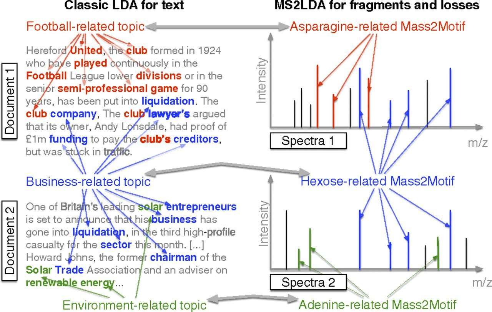

## How MS2LDA Works

**MS2LDA** applies *probabilistic topic modeling*, originally developed for natural language processing (NLP), to **tandem mass spectrometry (MS/MS)** data. This allows the unsupervised discovery of substructure patterns in complex chemical mixtures using tandem masss spectrometry.

## The basic Concept

Just as topic modeling identifies themes in a collection of texts by detecting patterns of word co-occurrence, MS2LDA identifies **recurring patterns of mass fragments and neutral losses** (called **Mass2Motifs**) across large MS/MS datasets. MS2LDA uses **Latent Dirichlet Allocation (LDA)** to infer which motifs are most likely to explain the observed fragmentation patterns.

## Step-by-Step Overview

### 1. Preprocessing 🧹
- Convert MS/MS spectra into a *bag-of-fragments* format
- Extract **neutral losses**
- Filter out **noise**

### 2. Model Training 🧠
- Apply **LDA** to the processed spectra
- Learn **Mass2Motifs** that describe recurring fragmentation patterns

### 3. Postprocessing & Annotation 🧾
- Visualize **motif loadings** across spectra
- Compare motifs to known entries in **MotifDB**
- Automated annotation of **M2M** using **MAG**

### 4. Analysis & Interpretation
- Visualize **motif loadings** across spectra
- Compare motifs to known entries in **MotifDB**
- Automated annotation of **M2M** using **MAG**

### Do you want to learn more?
Check out the following references 📚:

**van der Hooft et al. PNAS, 2016** ([https://doi.org/10.1073/pnas.1608041113](https://doi.org/10.1073/pnas.1608041113))

**Rogers et al. Faraday Discussions, 2019** ([https://doi.org/10.1039/C8FD00235E](https://doi.org/10.1039/C8FD00235E))
  
**Torres Ortega et al. bioRxiv, 2025** ([https://doi.org/10.1101/2025.06.19.659491](https://doi.org/10.1101/2025.06.19.659491))
