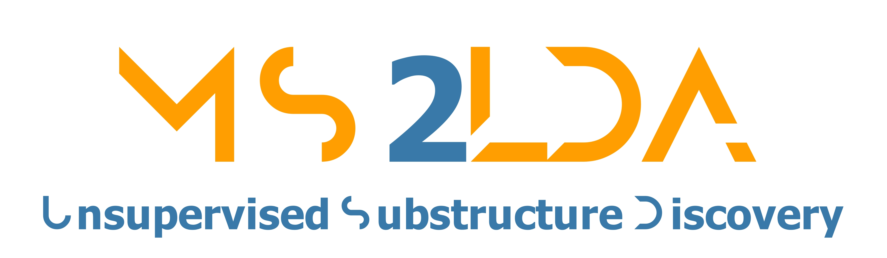

## About Topic Modelling in Mass Spectrometry

The application of topic modelling to mass spectrometry data represents a paradigm shift in the analysis of complex molecular fragmentation patterns. Traditional approaches to mass spectral interpretation rely heavily on spectral matching against reference libraries or manual expert annotation, both of which are limited by the availability of reference spectra and the complexity of interpreting unknown compounds. Topic modelling, originally developed for natural language processing, offers an unsupervised machine learning approach that can discover latent patterns in mass spectrometry data without requiring prior knowledge of compound structures.

In the context of mass spectrometry, topics correspond to recurring fragmentation patterns or "Mass2Motifs" that represent conserved substructures across different molecules. These patterns emerge from the statistical co-occurrence of fragment ions and neutral losses across large collections of tandem mass spectra. By decomposing complex spectra into combinations of these fundamental motifs, MS2LDA enables researchers to identify structural features even in previously uncharacterized compounds, thereby accelerating the process of molecular structure elucidation.

## Overview

MS2LDA (Mass Spectrometry Latent Dirichlet Allocation) is a computational framework that applies probabilistic topic modelling to tandem mass spectrometry data for automated discovery and annotation of molecular substructures. The methodology extends Latent Dirichlet Allocation (LDA) to handle the unique characteristics of mass spectral data, including the sparsity of fragmentation patterns and the continuous nature of mass-to-charge ratios.

The core innovation of MS2LDA lies in its ability to learn Mass2Motifs directly from experimental data without supervision. These motifs capture recurring fragmentation patterns that often correspond to specific chemical substructures or functional groups. The framework incorporates several key components: preprocessing routines for spectral alignment and noise reduction, the LDA model for motif discovery, visualization tools for result interpretation, and integration with molecular networking approaches for enhanced structural annotation.

Recent developments have expanded MS2LDA's capabilities through the incorporation of advanced machine learning techniques. The integration of Spec2Vec enables semantic similarity calculations between spectra based on learned embeddings, while the MotifDB provides a searchable repository of previously characterized Mass2Motifs with structural annotations. These enhancements facilitate more accurate and efficient annotation of unknown compounds in complex mixtures.

## Developers

MS2LDA is developed and maintained by an international collaborative team of computational mass spectrometry researchers. The current development is led by Rosina Torres Ortega, Jonas Dietrich, and Joe Wandy, with principal investigator Justin J.J. van der Hooft at Wageningen University & Research. The project builds upon foundational work established in the original MS2LDA publication (van der Hooft et al., PNAS, 2016) and represents ongoing efforts to advance computational methods for metabolomics and natural products research.

The development team welcomes contributions from the scientific community and maintains active collaborations with researchers in metabolomics, natural products chemistry, and computational biology. For detailed information about the methodology, validation studies, and recent applications, readers are referred to the comprehensive description in Torres Ortega et al. (2025) available at https://doi.org/10.1101/2025.06.19.659491.

## Documentation Structure

This documentation provides comprehensive guidance for using MS2LDA in metabolomics research. The User Guide section covers installation, basic usage, and parameter optimization. The API Reference documents all functions and classes available for programmatic access. Examples and tutorials demonstrate practical applications across various research domains. For questions not addressed in this documentation, users are encouraged to consult the GitHub repository or contact the development team.